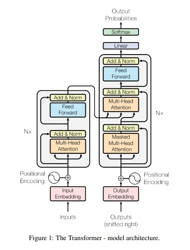
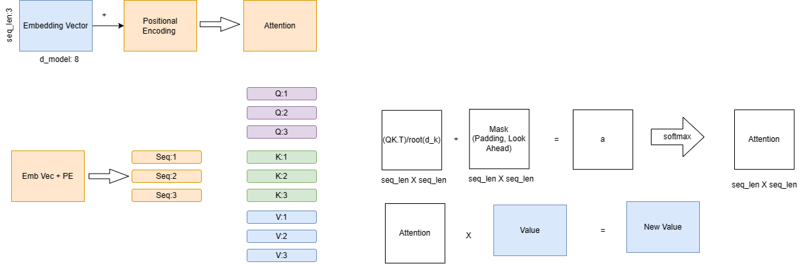

# Translation English to Nepali
Character level translation from English to Nepali using Transformer model.
For this task we created vocab for both english and nepali characters using parallel corpus.

## DataSet :
- [Dataset](https://drive.google.com/file/d/1UThfJKJFvDgTu263DNbz-WPNLqoARZ_0/view ) from github [repo](https://github.com/rameshhpathak/nepali-nlp-resources)

## Preprocessing : 
- Removed all data having other characters except english and nepali characters.
- Removed all data having more than 256 characters in english and nepali. which captures 95% of data which helped in removing outliers having very long sentences.
- This helped in reducing the dataset size from 1.5L to 1.3L (i.e., 151937 to 132091 sentences)
- Further it is split into train and test set with 80:20 ratio. (Train size: 105672, Test size: 26419) 

## Model :
- [Transformer](https://arxiv.org/abs/1706.03762) model is used for translation.
    - d_model = 512
    - batch_size = 128
    - ffn_hidden = 2048
    - num_heads = 8
    - drop_prob = 0.1
    - num_layers = 2  (Encoder/ decoder head)
    - max_sequence_length = 256

## Training :
- batch_size = 64
- EPOCHS = 20
- Optimizer : Adam
- LR = 1e-4
- Loss : CrossEntropyLoss

## Results :
- As the most of the data is office realted data. So iot was performing well on office related sentences. But it was not performing well on general sentences.
- The model was splitting each char like in रोहित it tries to generate as रओहित which can be solved by using subword tokenization.

## Issues Faced :
- Dependecies were not getting installed properly. So I had to create a new environment and install all the dependencies again.
- The model and data were on different devices. So I had to move the model to the same device as data.
- CUDA run out of memory. So I had to reduce the batch size to 64.

## Transformer:

# Resources
- [Layer Norm] (https://www.pinecone.io/learn/batch-layer-normalization/)